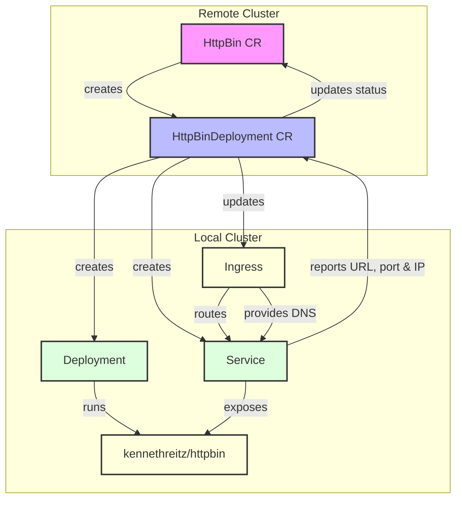

# example-httpbin-operator

A Kubernetes operator that manages HttpBin deployments in a Kubernetes cluster. The operator provides a simplified way to deploy and manage HttpBin instances through Kubernetes custom resources.

## Description

The example-httpbin-operator implements a multi-cluster control mechanism for managing HttpBin deployments:

1. The `HttpBin` custom resource (CR) serves as the primary user interface for requesting HttpBin instances in the remote cluster
2. When an `HttpBin` CR is created, the operator automatically creates a corresponding `HttpBinDeployment` CR in the remote cluster
3. The `HttpBinDeployment` controller then creates and manages the actual Kubernetes Deployment and Service running the HttpBin container in the local cluster
4. The operator supports HTTPS configuration through the HttpBin spec, automatically configuring the appropriate ports



This architecture provides:
- Clean separation of concerns between user interface (`HttpBin`) and implementation details (`HttpBinDeployment`)
- Automated deployment management with proper Kubernetes ownership chains
- Consistent cleanup through Kubernetes garbage collection
- Flexible service configuration options

### Controllers

#### HttpBin Controller
The HttpBin controller manages the lifecycle of HttpBin custom resources. Its primary responsibilities include:
- Creating corresponding HttpBinDeployment resources
- Managing finalizers for proper cleanup
- Establishing ownership relationships for garbage collection
- Maintaining status information:
  * URL: Combined DNS name and port from HttpBinDeployment
  * IP: Ingress IP from HttpBinDeployment
  * Port: Exposed service port from HttpBinDeployment

#### HttpBinDeployment Controller
The HttpBinDeployment controller handles the actual deployment of HttpBin instances. It manages:
- Kubernetes Deployments running the httpbin container
- Kubernetes Services for accessing the httpbin instances
- Ingress resources with automatic DNS configuration
- Resource updates when configurations change
- Status updates reflecting:
  * Deployment readiness
  * DNS name configuration
  * Exposed service ports
  * Load balancer ingress IP/hostname

### Resource Configurations

#### HttpBinDeployment Spec
The HttpBinDeployment resource supports various configuration options:

```yaml
apiVersion: orchestrate.platform-mesh.io/v1alpha1
kind: HttpBinDeployment
metadata:
  name: example-httpbin
spec:
  service:
    name: my-httpbin-svc  # Optional: defaults to CR name
    type: NodePort        # Optional: ClusterIP, NodePort, or LoadBalancer (default: ClusterIP)
    port: 8080           # Optional: Service port (default: 80)
    annotations:         # Optional: Service annotations
      custom.annotation: value
  deployment:
    name: my-httpbin     # Optional: defaults to CR name
    replicas: 2          # Optional: number of replicas (default: 1)
    annotations:         # Optional: Deployment and Pod annotations
      custom.annotation: value
    labels:             # Optional: Additional labels for Deployment and Pods
      custom.label: value
```

The controller automatically configures:
- DNS names for services using the pattern `<name>.msp.cc-poc-one.showroom.apeirora.eu`
- Ingress configuration:
  * Updates the shared "msp" Ingress resource in the default namespace
  * Adds DNS annotations for Gardener DNS integration
  * Configures path-based routing rules (/) to the service
  * Maintains DNS records through Gardener annotations
- Service status updates with DNS and connectivity information

The deployment uses the `kennethreitz/httpbin:latest` image and configures the following defaults:
- Resource requests: 100m CPU, 128Mi memory
- Resource limits: 200m CPU, 256Mi memory
- Container port: 80

## Development

### Multi-Cluster Architecture

The operator is designed to work across two Kubernetes clusters:
- Remote Cluster: Where the HttpBin and HttpBinDeployment CRs are managed
- Local Cluster: Where the actual Deployments and Services are created

This architecture enables:
- Clear separation between control plane (remote) and data plane (local)
- Centralized management of HttpBin instances across multiple clusters
- Efficient resource distribution and isolation

### Configuration Options

#### Kubeconfig for Remote Cluster

The operator supports configuring a kubeconfig to connect to a remote
cluster where the HttpBin CRs are created:

```yaml
operator:
  remoteKubeconfig: my-kubeconfig-secret
  remoteKubeconfigSubPath: path-in-secret
```

### Key Make Targets

The project includes several important make targets for development:

#### Building and Testing
```sh
# Generate manifests (CRDs, RBAC, etc.)
make manifests

# Generate API code (DeepCopy functions, etc.)
make generate

# Build the operator binary
make build

# Run unit tests
make test

# Run end-to-end tests (requires a running Kind cluster)
make test-e2e

# Build the operator container image
make docker-build IMG=<some-registry>/example-httpbin-operator:tag

# Push the operator container image
make docker-push IMG=<some-registry>/example-httpbin-operator:tag
```

#### Code Quality and Verification
```sh
# Run code generation verification
make verify

# Run golangci-lint checks
make lint

# Format code
make fmt
```

#### Deployment and Cleanup
```sh
# Install CRDs into the cluster
make install

# Deploy the operator to the cluster
make deploy IMG=<some-registry>/example-httpbin-operator:tag

# Uninstall CRDs from the cluster
make uninstall

# Undeploy the operator
make undeploy
```

## Getting Started

### Prerequisites
- go version v1.22.0+
- docker version 17.03+.
- kubectl version v1.11.3+.
- Access to a Kubernetes v1.11.3+ cluster.

### To Deploy on the cluster
**Build and push your image to the location specified by `IMG`:**

```sh
make docker-build docker-push IMG=<some-registry>/example-httpbin-operator:tag
```

**NOTE:** This image ought to be published in the personal registry you specified.
And it is required to have access to pull the image from the working environment.
Make sure you have the proper permission to the registry if the above commands don't work.

**Install the CRDs into the cluster:**

```sh
make install
```

**Deploy the Manager to the cluster with the image specified by `IMG`:**

```sh
make deploy IMG=<some-registry>/example-httpbin-operator:tag
```

> **NOTE**: If you encounter RBAC errors, you may need to grant yourself cluster-admin
privileges or be logged in as admin.

### Example Usage

1. Create a basic HttpBin instance:
```yaml
apiVersion: orchestrate.platform-mesh.io/v1alpha1
kind: HttpBin
metadata:
  name: httpbin-sample
```

2. Create a HttpBin instance with custom service configuration:
```yaml
apiVersion: orchestrate.platform-mesh.io/v1alpha1
kind: HttpBinDeployment
metadata:
  name: httpbin-custom
spec:
  service:
    type: NodePort
    port: 8080
  deployment:
    replicas: 2
```

You can apply the samples (examples) from the config/sample:

```sh
kubectl apply -k config/samples/
```

>**NOTE**: Ensure that the samples has default values to test it out.

### To Uninstall
**Delete the instances (CRs) from the cluster:**

```sh
kubectl delete -k config/samples/
```

**Delete the APIs(CRDs) from the cluster:**

```sh
make uninstall
```

**UnDeploy the controller from the cluster:**

```sh
make undeploy
```

## Project Distribution

Following are the steps to build the installer and distribute this project to users.

1. Build the installer for the image built and published in the registry:

```sh
make build-installer IMG=<some-registry>/example-httpbin-operator:tag
```

NOTE: The makefile target mentioned above generates an 'install.yaml'
file in the dist directory. This file contains all the resources built
with Kustomize, which are necessary to install this project without
its dependencies.

2. Using the installer

Users can just run kubectl apply -f <URL for YAML BUNDLE> to install the project, i.e.:

```sh
kubectl apply -f https://raw.githubusercontent.com/<org>/example-httpbin-operator/<tag or branch>/dist/install.yaml
```

## Contributing

Contributions are welcome! Here's how you can help:

1. Fork the repository
2. Create a feature branch
3. Make your changes
4. Run the test suite using `make test`
5. Submit a pull request

Please ensure your code:
- Passes all tests (`make test`)
- Includes appropriate test coverage for new features
- Follows the existing code style
- Includes relevant documentation updates

More information can be found via the [Kubebuilder Documentation](https://book.kubebuilder.io/introduction.html)

## License

Copyright 2024.

Licensed under the Apache License, Version 2.0 (the "License");
you may not use this file except in compliance with the License.
You may obtain a copy of the License at

    http://www.apache.org/licenses/LICENSE-2.0

Unless required by applicable law or agreed to in writing, software
distributed under the License is distributed on an "AS IS" BASIS,
WITHOUT WARRANTIES OR CONDITIONS OF ANY KIND, either express or implied.
See the License for the specific language governing permissions and
limitations under the License.
